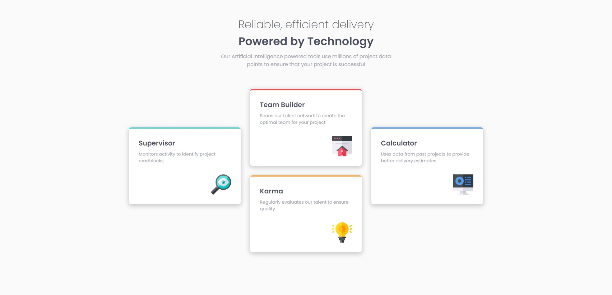
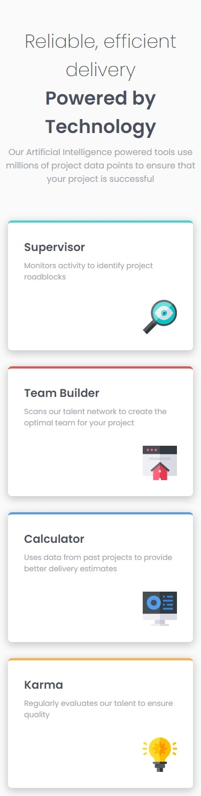

# Four card feature section solution

This is a solution to the [Four card feature section challenge on Frontend Mentor](https://www.frontendmentor.io/challenges/four-card-feature-section-weK1eFYK). Frontend Mentor challenges help you improve your coding skills by building realistic projects.

## Table of contents

- [Overview](#overview)
  - [The challenge](#the-challenge)
  - [Screenshot](#screenshot)
  - [Links](#links)
- [My process](#my-process)
  - [Built with](#built-with)
  - [What I learned](#what-i-learned)
  - [Continued development](#continued-development)
- [Author](#author)
- [Acknowledgments](#acknowledgments)

## Overview

### The challenge

Users should be able to:

- View the optimal layout for the site depending on their device's screen size.

### Screenshot

Desktop;

Mobile;

- Solution URL: [Frontend Mentor](https://www.frontendmentor.io/solutions/columns-with-display-flex-flex-wrap-and-transform-lXdFtd-luM)
- Live Site URL: [GitHub Pages](https://github.com/filipesilvait/four-card-feature-section-master)

## My process

### Built with

- Semantic HTML5 markup
- CSS custom properties
- Flexbox

### What I learned

I reinforced and developed my skills and knowledge in HTML and CSS. My goal is to acquire the domain.

### Continued development

I want to keep learning about HTML and CSS. JavaScript only when I master HTML and CSS.

## Author

- Website - [Filipe Silva](https://www.linkedin.com/in/filipesilvait/)
- Twitter - [@filipesilvait](https://twitter.com/filipesilvait)

## Acknowledgments

I was inspired by some solutions from [Florin Pop](https://www.linkedin.com/in/florinpop17/)
